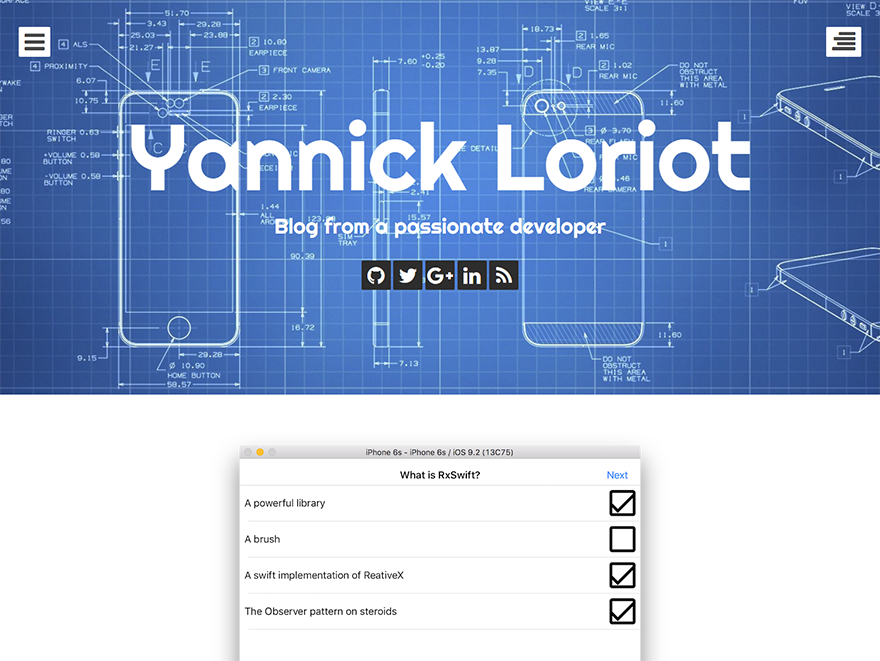

# WP Theme for yannickloriot.com

This is the theme used by the [yannickloriot.com](http://yannickloriot.com) blog.

It is based on the amazing [eighties theme](https://wordpress.org/themes/eighties/).

## License

YL, as the [original theme](https://wordpress.org/themes/eighties/), is licensed under the GPL v2.0.

All other resources are licensed as followed:

* Font Awesome - http://fontawesome.io/license (Font: SIL OFL 1.1, CSS: MIT License)
* FitVids - WTFPL license - http://sam.zoy.org/wtfpl/
* Backstretch - MIT - https://raw.githubusercontent.com/srobbin/jquery-backstretch/master/LICENSE-MIT
* header-default.jpg - http://www.toshox.com/blue-tech-wallpaper/hi-tech-backgrounds-wallpaper-cave.html
